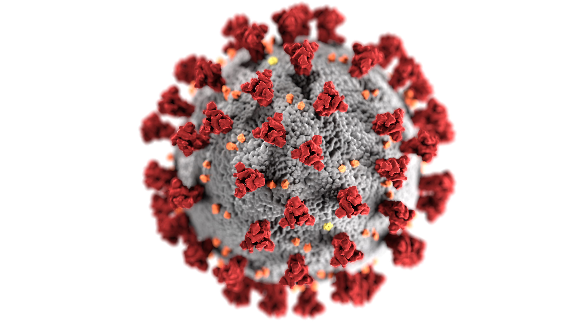
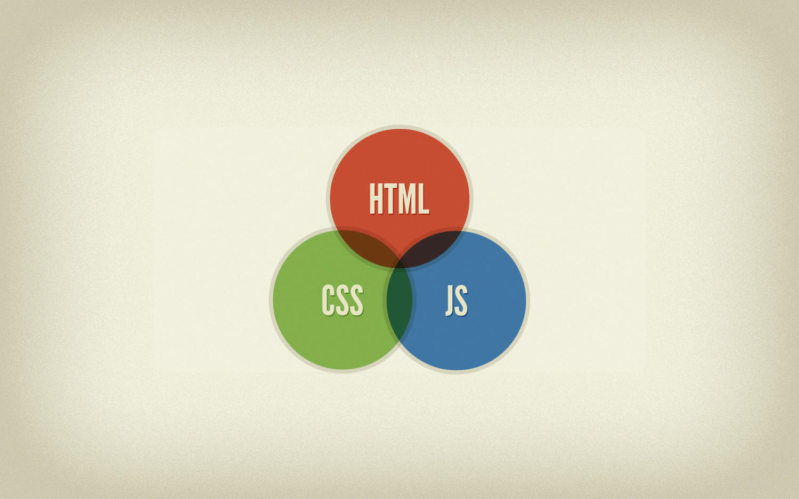

 

 

### Date: 7/22/2020
#### By: Alfonso D Rojas Hernandez 
#### | [GitHub](https://github.com/acostade29) | [LinkedIn](https://www.linkedin.com/in/alfonso-d-rojas-hernandez-2253a0105/)| 
***

##### The project was deployed on GitHub Pages and can be viewed via Heroku [here](https://coronatrackeralfonso.herokuapp.com//).
***

# User Experience#1:
## User Persona :
### Brenda, a developer, has two brothers. One currently lives in Colombia and the other one in the US. Since they don't communicate that often, she wanted to build an application to help her track the status of the countries where their bother lives, as well be able to communicate by sending public comments to her family members and friends. 

### ***Description***
|Coronavirus Tracker |
|---|
| User will be able to interact with and app able to check a list of comments post by the community|
| The user will be able to interact with the app. Add and delete comments will be available for the user. The user, only going to be able to delete their own comments. |
| Features to use: |
| check on the most current coronavirus database|
|interact with the graphic and to be able to diplay the current status on each country|
| Create and add comments|
| Delete comment|

***

### ***Getting Started***
|Screenshot|
|Main website|

| Authorization|

|Navegation bar|
|CoronaTracker :User will have access to the link of the main site|

|add comment: This option will provide the user the option to add comments once is log into the application|

|delete comments: This option will provide the user the option to delete comments once is log into the application|

|API Structure: user will be able to interact with the coronavirus data. 
the user will have access to current worldwide data ( infected, recovered and deaths)  as well shearch information to specific countries|

   

### ***Technologies Used***

- For brand logo:
- canva.com
- materialize
- Material UI 
- API Data :  https://covid19.mathdro.id/api

# Trelloboard and structure of the website [here](https://trello.com/b/7aZAMKpY/covid-19tracker).

## Future Updates 
- improve the design of the app.
- Add a second API with news.  

## Thank you 
- Thank you to all my classmates and my instructor Ben Manley. Everybody help me to achieve and make this app to work and function properly.

 
